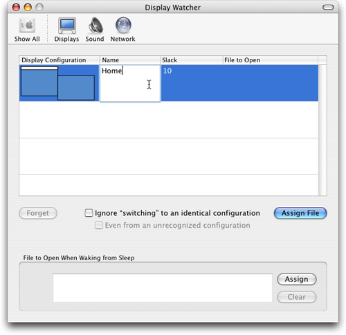

# DisplayWatcher

This is an open-source release of a Mac utility that I created in
2004. In the fall of 2019 I received an email asking if I would update
it to work in macOS Catalina (which requires code to be compiled with
64 bit addressing), and I realized that I had forgotten entirely about
the project, and the Xcode project files were too old to even be
opened and migrated by my current build tools. Thankfully, I had a
friend with an old enough machine and Xcode version that we were able
to rescue them.

In order to make sure that it no longer depends on my copy of the
source code or time to keep it up to date, I have moved it to Github.
The [original project
page](http://www.brunchboy.com/displaywatcher.shtml) describes the
history and motivation for it.

## Installation

To download a current build, go to the
[releases](https://github.com/Deep-Symmetry/DisplayWatcher/releases)
page.

> :warning: If you are migrating from the pre-GitHub version of
> DisplayWatcher you will want to delete the old pref pane from your
> System Preferences, since I am using a new bundle ID to go with my
> Apple Developer account so that I can properly code sign releases.
> That also means if you want your old settings to apply, you will
> want copy `~/Library/Preferences/com.brunchboy.DisplayWatcher.plist`
> to `~/Library/Preferences/org.deepsymmetry.DisplayWatcher.plist`
> after [quitting](#quitting-displaywatcher) the old DisplayWatcher
> background application using Activity Monitor and before starting
> the new one. You will also want to remove the old application from
> your Startup Items, and add the new one. Instructions on how to do
> all these things can be found below.

The release archive contains two files, the DisplayWatcher
application, and the preference pane.

### DisplayWatcher

DisplayWatcher itself is an application that runs invisibly in the
background. You can put it anywhere on your disk that makes sense.
Just drag the application to an appropriate folder. I have it in a
utilities folder on my own system.

Once you've moved it to where you want to keep it, you can launch it,
by simply double-clicking it in the Finder. You will need to do this
once before the preference pane will work right. (You will also want
to set it up to run each time you log in, as described
[below](#starting-displaywatcher-automatically).)

When you launch DisplayWatcher, you may be surprised to find nothing
at all happening. No windows or menus appear, not even an icon in the
dock. That's because its purpose is to run silently in the background,
launching files when you switch to a recognized display configuration,
or when your computer wakes up after sleeping. But when you first
install it, you've not set up any files to be launched, so it won't do
anything. You need to configure it, and since it doesn't have any
interface of its own, that brings us to...

### The DisplayWatcher Preference Pane

The configuration and settings of DisplayWatcher are managed using a
System Preferences pane. To install it, you can take advantage of help
offered by the **System Preferences** utility. You don't even need to
copy the file to your own hard drive. Simply double-click on the file
`DisplayWatcher.prefPane` that you extracted from the release archive
and System Preferences will offer to install it for you:

If you want multiple users to be able to set up their own
DisplayWatcher settings, choose the "all users" installation (which
will put it in `/Library/PreferencePanes`). More commonly, you'll
install it just for yourself, which puts it in
`~/Library/PreferencePanes`. Either way, once you click "Install",
System Preferences will install and open the pane for you, and you are
ready for the next step.

## Configuring DisplayWatcher

The first time you open the DisplayWatcher preference pane it will
contain no file assignments. Each time you open it, the preference
pane checks whether the current screen configuration matches any that
it's seen before, and if not, it adds a new untitled entry for it.
Since this is the first launch, there will be a single entry for your
current screen configuration:

The "Display Configuration" column shows the relative sizes and
positions of the displays in each screen configuration, as well as the
location of the menu bar. This can help you recognize which one you're
working with, but I'd still recommend clicking in the "Name" column
and assigning a descriptive name as you create each configuration that
you care about. It will help you distinguish them in the future,
especially if you end up with some that differ only in resolution,
which can't be seen in the picture.

The "Slack" column controls the tolerance with which DisplayWatcher
matches screen configurations. It allows monitors to be positioned up
to that many pixels away from the arrangement in which they were found
when the configuration was memorized. (The resolutions have to match
exactly, though). This is useful in case your Mac ever forgets the
arrangement that you use with a particular monitor when you plug back
in to it, and forces you to manually recreate your preferred
arrangement. That happens much less frequently than it did in the
early days of Mac OS X, but if it ever does, you'll be glad you don't
have to get it exactly right. I actually tend to use a slack of 30 for
my dual-screen setup at home.

Finally, you need to tell DisplayWatcher what to do when it sees your
Mac enter this screen configuration. Click on the "Assign File"
button, and choose a file to be opened when the configuration is
recognized.

What kind of files does it make sense to have DisplayWatcher open? I
used to find [AppleScript](https://en.wikipedia.org/wiki/AppleScript)
applets an ideal combination of power and convenience. They can be
used to change system settings, to tell scriptable applications to
perform tasks, and to execute shell scripts if needed. If you've got
more of a Unix background and don't want to learn AppleScript, you can
save a shell script with the suffix ".command" and have DisplayWatcher
open that, which will cause it to be executed in Terminal. Or you
could just save it as a Unix executable script, and have it executed
in the background.

Or you might have some other scripting environment or automation tool
that you like to use. Anything that can be invoked by double-clicking
on it in the Finder can be automatically launched by DisplayWatcher
when it detects the appropriate monitor configuration.

To round out the setup, change your display configuration to another
one where you want things arranged differently, then switch back to
the DisplayWatcher preference pane if needed. Assign names and the
appropriate script, file or application to each configuration, and
you're good to go! Try unplugging the external monitor, watch that
script run, plug it back in and watch the other script run. Pretty
neat, eh?

There are a couple other features in the interface worth explaining.
Whenever you've selected a row that corresponds to a display
configuration that isn't the current configuration, the "Forget"
button will be enabled. If you click "Forget" and confirm the sheet
that pops up, the highlighted row will be removed. If you're no longer
using a particular configuration and don't want it cluttering up your
interface, this is how to get rid of it.

The two checkboxes deal with some subtleties I didn't expect when I
first started using the program. The "Ignore" checkbox tells
DisplayWatcher not to launch the assigned file if your Mac reports
that it has switched to a screen configuration that matches the
configuration that was in effect before the switch. When would that
happen? Well, suppose you changed the bit depth (color mode) of one of
your displays. That triggers a configuration change event, but the
resolution and arrangement are no different. I found it quite
disconcerting to have my scripts run in that circumstance, so I added
(and checked) this option.

If you play any games, you'll run into this issue a lot. And since
they tend to also change the screen resolution on you while the game
is running, I needed to add the second checkbox as well. When the game
reduces the screen resolution, the Mac reports that it is switching to
a configuration that DisplayWatcher hasn't memorized. That's fine, no
script runs. But when the game ends, the Mac switches back to the
prior screen configuration, which is recognized. I didn't want the
script to run redundantly in that circumstance either, so I added (and
checked) the second checkbox.

These options don't currently default to checked, but I suspect most
people (at least people who play games) will want them on, so perhaps
I should change the default.

Finally, the bottom section allows you to assign a file that will get
launched whenever the computer wakes up from sleeping. My script sets
up some SSH tunnels I always want, and then if Mail is running, sleeps
for a bit and takes Mail back online so it can detect that the tunnels
it needs are back up. The "Clear" button removes the wake-up file
assignment.

## Starting DisplayWatcher Automatically

Once you've decided you like DisplayWatcher, you won't want to have to
manually launch every time you restart your Mac (or log out and back
in). You can use the **Login Items** feature of macOS to do it for
you. Open System Preferences again if you've closed it, and go to the
**Users & Groups** preference pane. Select your account and switch to
the Login Items tab. Click the "+" below the list of login items to
add a new one:

Navigate to where you've installed DisplayWatcher, and add it:

Now DisplayWatcher will start automatically whenever you log in. If
you ever want to stop this happening, just come back to this same
preference pane tab, select DisplayWatcher and click the "-" button to
remove it.

## Quitting DisplayWatcher

If, for some reason, you want DisplayWatcher to exit, the easiest way
to tell it to quit is to use Apple's Activity Monitor. You'll find it
in the Applications→Utilities folder. Launch it, and you'll be able to
see whether DisplayWatcher is running (you can type a filter phrase
like "display" in the search box at the top right to narrow down the
processes you are looking at). If it is running, and you want to shut
it down, select it and click on the "Quit Process" button, which is
the top left button, which looks like a gray stop sign with an X in
it:

Activity Monitor will ask you for confirmation. You can use the
regular "Quit" button or press **Return**; there's no need to use
"Force Quit":

Once you click on Quit, DisplayWatcher will stop running until you
launch it again, or until the next time you log in (if you've got it
set up as a [Startup Item](#starting-displaywatcher-automatically).

## Uninstalling DisplayWatcher

If you're done with DisplayWatcher and want to get rid of it,
basically reverse the process you followed to install it. First, if
it's running, tell it to [quit](#quitting-displaywatcher) as described
above. Then, drag the DisplayWatcher application into the trash. If
you want to be graceful about it, you can also manually remove it as a
Login Item for your account. You'll want to launch System Preferences
anyway to remove the DisplayWatcher preference pane.

Simply control-click (or two-finger click or right-click) on the
DisplayWatcher icon in System Preferences, and choose to remove the
preference pane. It will be uninstalled for you:

## Building DisplayWatcher

If you want to make your own version with new features, the
[Xcode](https://developer.apple.com/xcode/) project for the
application is in [DisplayWatcher](DisplayWatcher), and the project
for the preference pane is in
[DisplayWatcherPane](DisplayWatcherPane). Some application header
files are referenced from within the preference pane project using
project-relative references, so be sure to keep those folders next to
each other and named the same, or you will need to fix the projects.

As things stand, there are a great many warnings about deprecated APIs
and the like, which is not surprising because this code was written
fifteen years ago. It frankly amazes me that I was able to get it
building again in just an afternoon. If I get ambitious, I may clean
it up, and also add some more instructions and background information
about how it works. However, if anyone else would like to do those
things, pull requests would be welcome too!

## Licenses

Copyright © 2004&ndash;2019 [Deep Symmetry, LLC](http://deepsymmetry.org)

Distributed under the [GNU General Public License, version 3](LICENSE).
