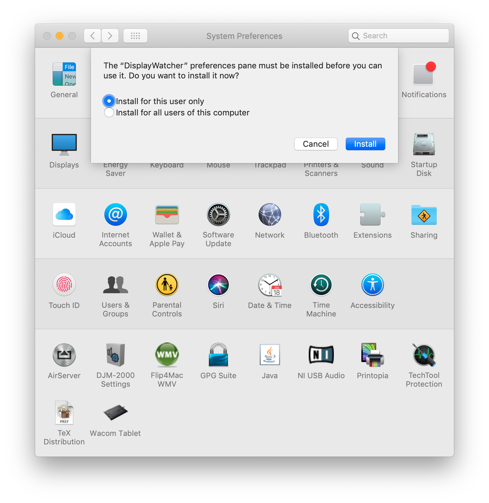

# DisplayWatcher

This is an open-source release of a Mac utility that I created in
2004. In the fall of 2019 I received an email asking if I would update
it to work in macOS Catalina (which requires code to be compiled with
64 bit addressing), and I realized that I had forgotten entirely about
the project, and the Xcode project files were too old to even be
opened and migrated by my current build tools. Thankfully, I had a
friend with an old enough machine and Xcode version that we were able
to rescue them.

In order to make sure that it no longer depends on my copy of the
source code or time to keep it up to date, I have moved it to Github.
The [original project
page](http://www.brunchboy.com/displaywatcher.shtml) describes the
history and motivation for it.

## Installation

To download a current build, go to the
[releases](https://github.com/Deep-Symmetry/DisplayWatcher/releases)
page.

The release archive contains two files, the DisplayWatcher
application, and the preference pane.

### DisplayWatcher

DisplayWatcher itself is an application that runs invisibly in the
background. You can put it anywhere on your disk that makes sense.
Just drag the application to an appropriate folder. I have it in a
utilities folder on my own system.

Once you've moved it to where you want to keep it, you can launch it,
by simply double-clicking it in the Finder. You will need to do this
once before the preference pane will work right. (You will also want
to set it up to run each time you log in, as described below.)

When you launch DisplayWatcher, you may be surprised to find nothing
at all happening. No windows or menus appear, not even an icon in the
dock. That's because its purpose is to run silently in the background,
launching files when you switch to a recognized display configuration,
or when your computer wakes up after sleeping. But when you first
install it, you've not set up any files to be launched, so it won't do
anything. You need to configure it, and since it doesn't have any
interface of its own, that brings us to...

### The DisplayWatcher Preference Pane

The configuration and settings of DisplayWatcher are managed using a
System Preferences pane. To install it, you can take advantage of help
offered by the **System Preferences** utility. You don't even need to
copy the file to your own hard drive. Simply double-click on the file
`DisplayWatcher.prefPane` that you extracted from the release archive
and System Preferences will offer to install it for you:

